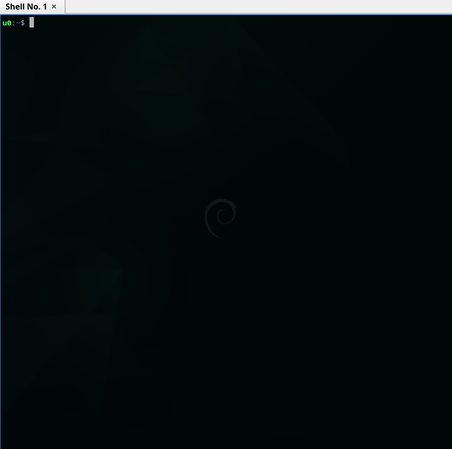

# Holloway's HiAI
[](#holloways-hiai)

A local terminal polygot (POSIX Shell x PowerShell) bridging LLM AI prompt
interaction capabilities directly to your computer!

Turn every computer's terminal into an interactive AI prompt.

[](#holloways-hiai)


> [!important]
>
> Special thanks to [Google](https://gemini.google.com/) for sponsoring its
> [Google Gemini Advanced Ultra](https://ai.google.dev/pricing) services allowing
> this app to be possibly realized.


## Why It Matters

Some good business reasons why using AutomataCI:

1. **Use AI prompt straight from the terminal** - No need to visit here and
   there just to use AI prompt.
2. **Simple and straight forward** - Frankly, it's created to resolve some AI
    prompt's buggy UI.
3. **Steadily improvable** - Will continue to improve over time.
4. **Programmable** - I'm so done with copy-pasting prompt constructors.


## Supported AI Vendors

1. [Google AI](https://ai.google.dev/docs/gemini_api_overview) - [Get API Token](https://gemini.google.com/app)


## To Install

The software is packaged based on available OSes.


### Debian based OSes (`linux`, `hurd`, etc)

1. Download the latest `.deb` package from the [release section](https://github.com/ChewKeanHo/APP_hiAI/releases).
2. perform `$ dpkg -i <package>.deb`.

Don't worry, the package will setup the upstream `apt` repository list source
alongside the required GPG key for future `apt update`.


### Red Hat based Linux OS (`redhat`, `fedora`, etc)

1. Download the latest `.rpm` package from the [release section](https://github.com/ChewKeanHo/APP_hiAI/releases).
2. perform `$ rpm -i <package>.rpm`.

Don't worry, the package will setup the upstream `yum` repository list source
alongside the required GPG key for future `yum update`.


### Flatpak

1. Download the latest `.flatpak` package from the [release section](https://github.com/ChewKeanHo/APP_hiAI/releases).
2. perform `$ flatpak --user install <package>.flatpak`.

Note that the command to use is:
`flatpak run com.github.chewkeanho.app_hiai ...` due to how Flatpak works. For
example, to get help, it is:

`$ flatpak run com.github.chewkeanho.app_hiai --help`

For direct installation in FlatHub, it's still work in progress.


### Homebrew (MacOS)

*Coming Soon*


### Chocolatey (Windows)

*Coming Soon*


### Docker / Podman

The container distribution is hosted on
[GitHub Packages](https://github.com/ChewKeanHo/APP_hiAI/pkgs/container/hollowayhiai).
Please keep in mind that the packages section is continuously updated with
development so the catalog can be confusing (e.g. you may see some development
images before release).

To pull an image with Docker, the command is as follows:

```
$ docker pull ghcr.io/chewkeanho/hollowayhiai:latest

# OR

# $ docker pull ghcr.io/chewkeanho/hollowayhiai:[VERSION]
# Example for `v0.0.2`:
$ docker pull ghcr.io/chewkeanho/hollowayhiai:0.0.2
```

To run with Docker, you need to mount your config file and execute using the
`ARGS` environment variables. The `--config` argument **MUST** match with
the pathing you mounted to (`target=`). For example:

```
# note - '-it' must always be the last argument
$ docker run --env ARGS="--config /CONFIG.toml --text2text 'Who are you?'" \
	--mount type=bind,source="/path/to/CONFIG.toml",target="/CONFIG.toml" \
	-it ghcr.io/chewkeanho/hollowayhiai:[VERSION]


# to call for help
$ docker run --env ARGS="--help" ghcr.io/chewkeanho/hollowayhiai:[VERSION]
```


### Plain Script

Use the `tar.gz` package or `zip` package on Windows OS.

Note that the command to use is: `hollowayhiai_[OS]-[ARCH].sh.ps1` (with file
extensions) instead of the guided `hollowayHIAI` since you're executing directly
from the script.


## How-tos, Documentations & Specifications

To use Holloway's HiAI, you need to first setup 1-time `CONFIG.toml` file:

```
# UNIX (Linux & MacOS) - POSIX Shell
$ hollowayHIAI --create-config path/to/file.toml

# WINDOWS - PowerShell
$ powershell.exe -noprofile `
	-executionpolicy bypass `
	-Command "& .\hollowayhiai_windows-[ARCH].sh.ps1 --create-config 'path\to\file.toml'"


# update the path/to/file.toml especially with the API token.
```

Once done, you may proceed to execute it:

```
# UNIX (Linux & MacOS) - POSIX Shell
$ hollowayHIAI --config path/to/file.toml --text2text "...your prompt..."


# WINDOWS - PowerShell
$ powershell.exe -noprofile `
	-executionpolicy bypass `
	-Command "& .\hollowayhiai_windows-[ARCH].sh.ps1 --config path\to\file.toml --text2text `"...your prompt...`""
```

In any cases, if you need any on-screen assistances:
```
# UNIX (Linux & MacOS) - POSIX Shell
$ hollowayHIAI --help


# WINDOWS - PowerShell
$ powershell.exe -noprofile `
	-executionpolicy bypass `
	-Command "& .\hollowayhiai_windows-[ARCH].sh.ps1 --help"
```


## To Contribute

Holloway's HiAI! cannot be made successfully without contributions from
(Holloway) Chew, Kean Ho, his teams, and supports from external folks. If you
had been using it and wish to contribute back, there are 2 ways to do so:


### Financial

To financially support the project, please head over to Holloway's sponorship
store here:

[](https://github.com/sponsors/hollowaykeanho)

A small token purchase would helps a lot.


### Craftmanship

If you wish to bring in codes contribution, bug report, and ideas, please feel
free to refer the PDF Handbook and execute accordingly.


## License
Holloway's HiAI! is licensed under OSI compatible
[Apache 2.0 License](LICENSE.txt).
